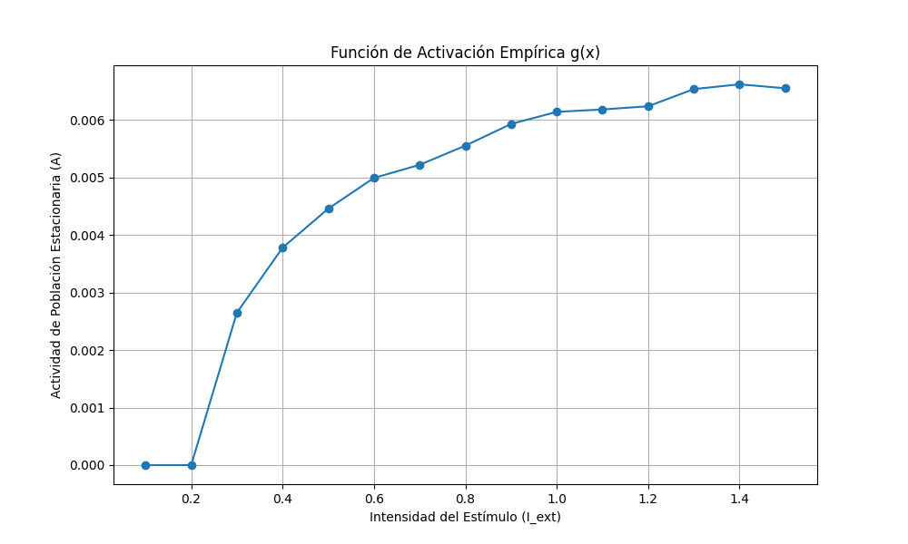
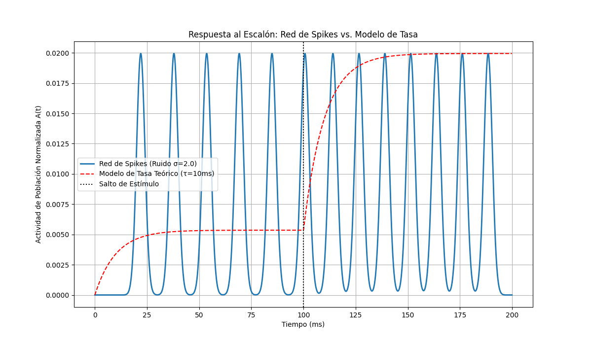

# Bloque 1: El Motor Biológico (Dinámica de Población)

Este bloque valida las propiedades fundamentales de las columnas corticales como unidades de población. Se demuestra que el modelo de red de picos es equivalente a un modelo de tasa de campo medio con una constante de tiempo efectiva ($\tau_{eff}$), una función de activación no lineal ($g(x)$), y una respuesta rápida a los estímulos.

## Figura 1: Constante de Tiempo Efectiva ($\tau_{eff}$)

La dinámica de la actividad de la población $A(t)$ en respuesta a un pulso de estímulo se ajusta a un modelo de integrador con fugas, revelando la constante de tiempo intrínseca del microcircuito.

## Figura 2: Función de Activación Sigmoidal ($g(x)$)

La relación entre la corriente de entrada estacionaria ($I_{ext}$) y la tasa de disparo de salida de la población ($A$) define la función de activación no lineal $g(x)$, que tiene una forma sigmoidal característica.

## Figura 3: Respuesta Rápida al Escalón (< 3ms)

La red de picos exhibe un tiempo de subida muy rápido en respuesta a un cambio abrupto en el estímulo, una propiedad crucial para el procesamiento de información en tiempo real que es capturada por el modelo de tasa equivalente.

