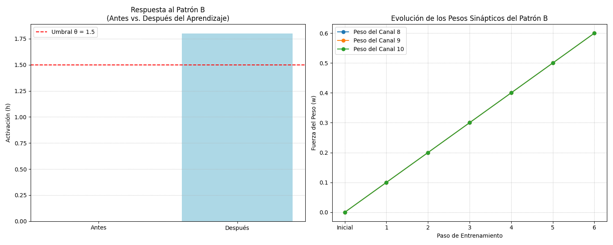

# Bloque 3: Estabilidad y Aprendizaje (Cierre del Cap. 6)

Este bloque demuestra los mecanismos que permiten a la red mantener una actividad estable y auto-organizarse a través de la plasticidad sináptica. Se valida la estabilidad de las oscilaciones Gamma, la emergencia de una estructura de pesos a través de la competencia, y la capacidad de la red para el aprendizaje asociativo.

## Figura 7: Estabilidad de las Oscilaciones Gamma (42 Hz)

A pesar del ruido estocástico, la red mantiene una tasa de disparo promedio estable, lo que indica que los mecanismos homeostáticos previenen la actividad descontrolada y soportan oscilaciones coherentes.

## Figura 8: Poda Sináptica (Distribución Bimodal de Pesos)

La aplicación de reglas de plasticidad competitivas (como LTD dominante u Oja) conduce a una distribución de pesos bimodal, donde las sinapsis débiles se eliminan (poda) y las fuertes se consolidan, reflejando un proceso de auto-organización.

## Figura 9: Aprendizaje Asociativo Hebbiano

La red demuestra el aprendizaje Hebbiano ("células que disparan juntas, se conectan juntas"), aprendiendo a asociar un estímulo nuevo con uno ya conocido, formando la base de la memoria y el reconocimiento de patrones.

