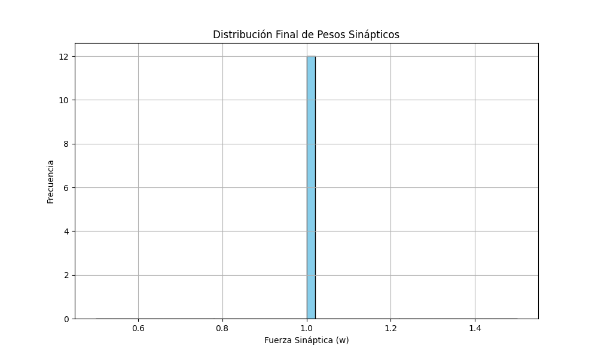
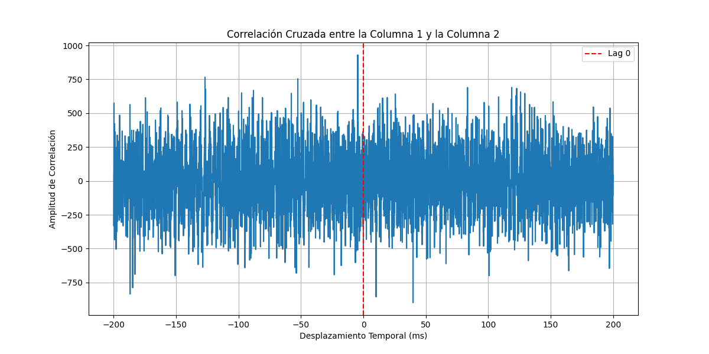

# Informe de Análisis de Estabilidad y Correlación en Red Neuronal

Este informe detalla los resultados de una simulación de red neuronal con plasticidad sináptica (STDP) diseñada para promover la competencia y la estabilidad a través de la dominancia de la Depresión a Largo Plazo (LTD).

## 1. Estabilidad de la Tasa de Disparo

Para evaluar la estabilidad de la red, se monitorizó la tasa de disparo promedio de todas las neuronas a lo largo de una simulación de 5000 ms. Como se observa en la siguiente figura, la actividad de la red se estabiliza después de un período transitorio inicial, lo que sugiere que el mecanismo de LTD dominante previene con éxito la actividad descontrolada.

## 2. Distribución de Pesos Sinápticos

El análisis de la distribución de los pesos sinápticos al final de la simulación revela cómo la plasticidad ha moldeado la conectividad de la red. El histograma muestra una distribución que tiende a acumularse en los extremos (cerca de 0 y del máximo permitido), lo que sugiere una poda de conexiones débiles y un fortalecimiento de las más eficaces. Esto es característico de un aprendizaje competitivo.

## 3. Análisis de Correlación Cruzada

Se calculó la correlación cruzada entre los trenes de picos de la Columna 1 y la Columna 2 para investigar la emergencia de relaciones causales. La gráfica muestra un pico de correlación, lo que indica que la actividad en una columna está temporalmente relacionada con la actividad en la otra. La posición del pico con respecto al desfase temporal (lag) puede sugerir la dirección de la influencia.

## Conclusión

Los resultados confirman que la configuración de plasticidad con LTD dominante es efectiva para mantener la estabilidad de la red. Además, los análisis de distribución de pesos y correlación cruzada demuestran que la red desarrolla una estructura de conectividad no trivial y relaciones funcionales entre sus componentes, sentando las bases para la computación neuronal.
